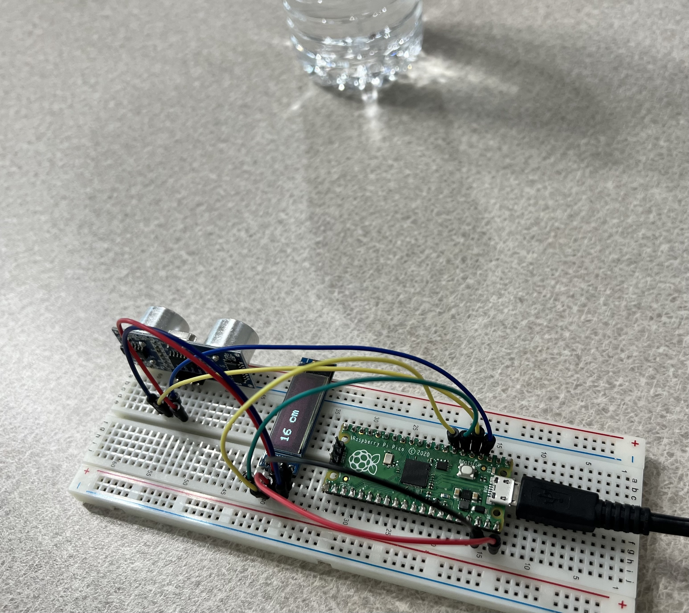

# Range Finder

## About

Range finder in C with Rpi Pico, HC-SR04 ultrasonic sensor, and an SSD1306 OLED display. For fun nd keeping up chops.

## Image of Project

## Modules

- Raspberry Pi Pico
- HC-SR04 Ultrasonic Sensor
- ssd1306 128x32 OLED Dispplay

## Schematic

// TODO: Add Schematic

## References

#### Code

- https://github.com/daschr/pico-ssd1306
- https://github.com/KleistRobotics/Pico-Ultrasonic

#### Compiing for Pi Pico

- https://www.digikey.com/en/maker/projects/raspberry-pi-pico-and-rp2040-cc-part-1-blink-and-vs-code/7102fb8bca95452e9df6150f39ae8422

#### Pico Pinout

- https://www.raspberrypi.com/documentation/microcontrollers/images/pico-pinout.svg

#### Datasheets

- https://cdn.sparkfun.com/datasheets/Sensors/Proximity/HCSR04.pdf
- https://datasheets.raspberrypi.com/rp2040/rp2040-datasheet.pdf
- https://cdn-shop.adafruit.com/datasheets/SSD1306.pdf
